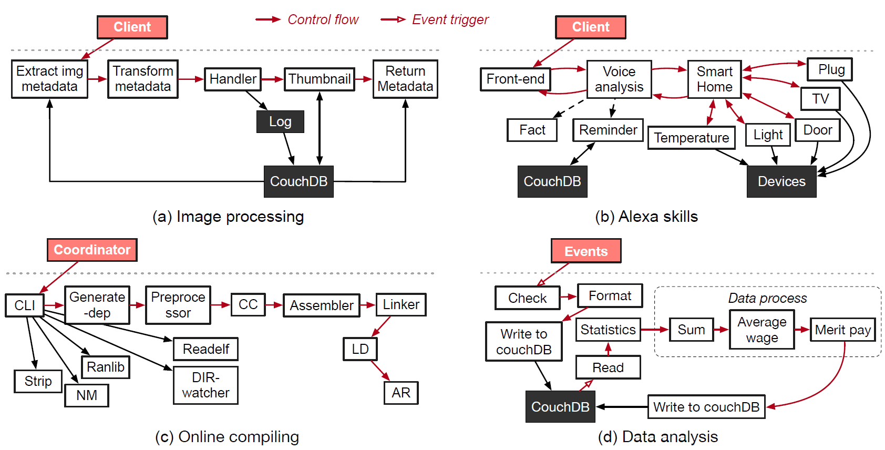

# Real-world applications
This test case includes four real-world serverless applications: Image processing, Alexa skill, Online-compiling, and Data analysis.

## Introduction
#### Architecture of the four real-world applications


### Image Processing

Image processing is one of the most widely-used serverless workloads in the cloud. [ServerlessBench](https://github.com/ServerlessBench/ServerlessBench) uses the workload to reveal the performance of sequence chain-based applications. The function is triggered when a request arrives. The request includes the name of an image in the cloud database (i.e., “CouchDB” in the figure). The function “Extract img metadata” is fired to extract the metadata from the image, and pass the result to the next function (“Transform metadata”) to validate the image format. After that, a “Handler” function is invoked to process the images, e.g., detecting objects in the image. The handled image, along with the extracted metadata, is saved to storage. Then a thumbnail is generated and packed in the function response to the client. The workload is ported from [AWS-examples repository](https://github.com/aws-samples/lambda-refarch-imagerecognition) to a Java version for greater language-diversity.

### Alexa Skills

ServerlessBench uses Alexa skills as a representative of serverless workloads in the IoT world and composed with nested function chain. [Alexa](https://developer.amazon.com/en-US/alexa) is an Amazon cloud-based voice service. The capabilities of Alexa depends on the “skills” it is equipped with, e.g., reading the daily news, playing the music, answering simple questions, etc. There are more than 100 thousand skills now, and the fact skill in [AWS serverless application repository](https://serverlessrepo.aws.amazon.com) is labeled by 47.6k deployments. Alexa skills workload consists of a “frontend” function, “voice analysis” function, and a set of functions for skills. ServerlessBench implements three skills: a fact skill, which provides a random fact; a reminder skill, which processes requests to associate places and related objects, and reminds clients what to bring for a specific location; and a smart home skill, which understands commands from clients and manages devices in a smart home.

For ease of evaluation, the smart home devices are represented by Docker containers which receive commands from the Alexa skills.

Caution: Alexa skills application is composed of nested function chain, which implies that the first invoker function would have to wait for all its callee functions to execute and finish before itself can successfully return. This requires that the serverless platform allows concurrency at least the number of functions in this call chain (in this case, 5 functions for a single invocation), and even higher concurrency for concurrent execution (suggest: at least **20** containers (function invokers) should be allowed to execute concurrently. If eval-config is modified to test higher concurrency level, please re-check the concurrency limit to make sure it works before testing).

### Online Compiling

Modern build systems such as make and Bazel offer multi-threaded compiling options
to boost compiling speed with parallelization. There are also various tools (e.g., [distcc](https://github.com/distcc/distcc), [icecc](https://github.com/icecc/icecream) further scaling out the compiling jobs to remote machines to benefit from the computing resources and parallelization in a distributed system. Thus, it is a natural match of auto-scaled and event-driven serverless computing and compiling jobs. [gg framework](https://github.com/StanfordSNR/gg) is a framework for outsourcing everyday applications (e.g. compiler) to severless. ServerlessBench includes gg framework as an example of serverless compiling workloads. We extend the gg framework with an OpenWhisk backend engine for serverless benchmarking in OpenWhisk. 

### Data Analysis

One typical serverless use case is to employ serverless functions to carry out some data analysis works upon changes in a data source, such as a database. ServerlessBench constructs a wage-data analysis workload
to represent serverless applications that are triggered by a third-party event-source, instead of by direct user requests. The data analysis workload begins with an insertion event of personal wage data. Data checker and formatter are applied to the wage data before it is finally inserted into the database (i.e., CouchDB in the figure). Once the wage entry is settled in CouchDB, the database change is detected and triggers a chain of wage analysis functions to process on the changed database. Finally, the analysis results of the updated wage data set are written back into CouchDB.

We construct data analysis based on [Cloudant data processing with IBM Cloud Functions (powered by Apache OpenWhisk)](https://github.com/IBM/ibm-cloud-functions-data-processing-cloudant), with our designed wage-data processing scenario. In order to get "changes" information from CouchDB, we also make use of [openwhisk-package-cloudant](https://github.com/apache/openwhisk-package-cloudant), and use a helper Docker container to poll changes from the CouchDB database.

## Deployment

### Prerequisite

- OpenWhisk and `wsk` cli tool.
  Check OpenWhisk configuration to make sure it allows at least **20** containers (action invokers) to execute concurrently, or some test cases (e.g., Alexa skill) might stuck and fail due to resource limitation. Similarly, if you modify eval-config to evaluate higher concurrency scenarios, the concurrency limitation from OpenWhisk should also be checked.
- Create the configuration file local.env from the template (template.local.env), change the configurations to your own settings (e.g. IP, port...)

### Denpendencies
- `gcc` >= 7.0
- `maven` >= 3.6.0
- `nodejs` >= 12.0
- `jq`

Dependencies for online-compiling application:
- `gcc` >= 7.0
- `protobuf-compiler`, `libprotobuf-dev` >= 3.0
- `libcrypto++-dev` >= 5.6.3
- `python3`
- `libcap-dev`
- `libncurses5-dev`
- `libboost-dev`
- `libssl-dev`
- `autopoint`
- `help2man`
- `texinfo`
- `automake`
- `libtool`
- `pkg-config`
- `libhiredis-dev`
- `python3-boto3`

You can install this dependencies in Ubuntu (17.04 or newer) by running:

```
sudo apt-get install maven nodejs jq\
                     gcc-7 g++-7 protobuf-compiler libprotobuf-dev \
                     libcrypto++-dev libcap-dev \
                     libncurses5-dev libboost-dev libssl-dev autopoint help2man \
                     libhiredis-dev texinfo automake libtool pkg-config python3-boto3
```

**It's strongly recommended to use Ubuntu 17.04 or newer**

### Deploy and test
Set the environment variable:

``` bash
    export TESTCASE4_HOME= $WHERE_YOUR_SERVERLESSBENCH_IS/Testcase4-Application-breakdown
```
Then:
```bash
    $ ./deploy.sh --all
    $ ./eval.sh --all
```
